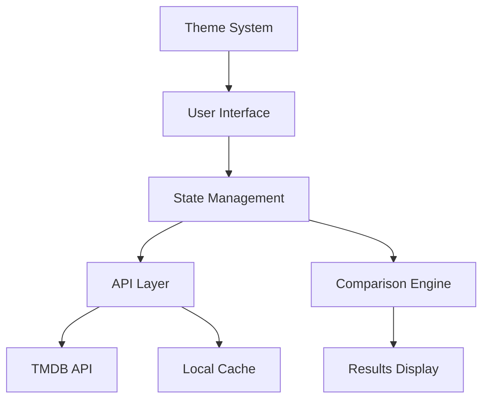
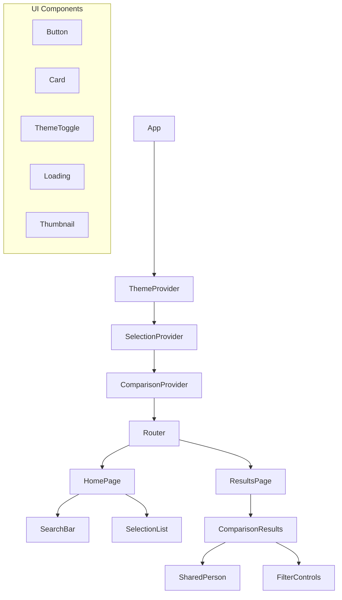
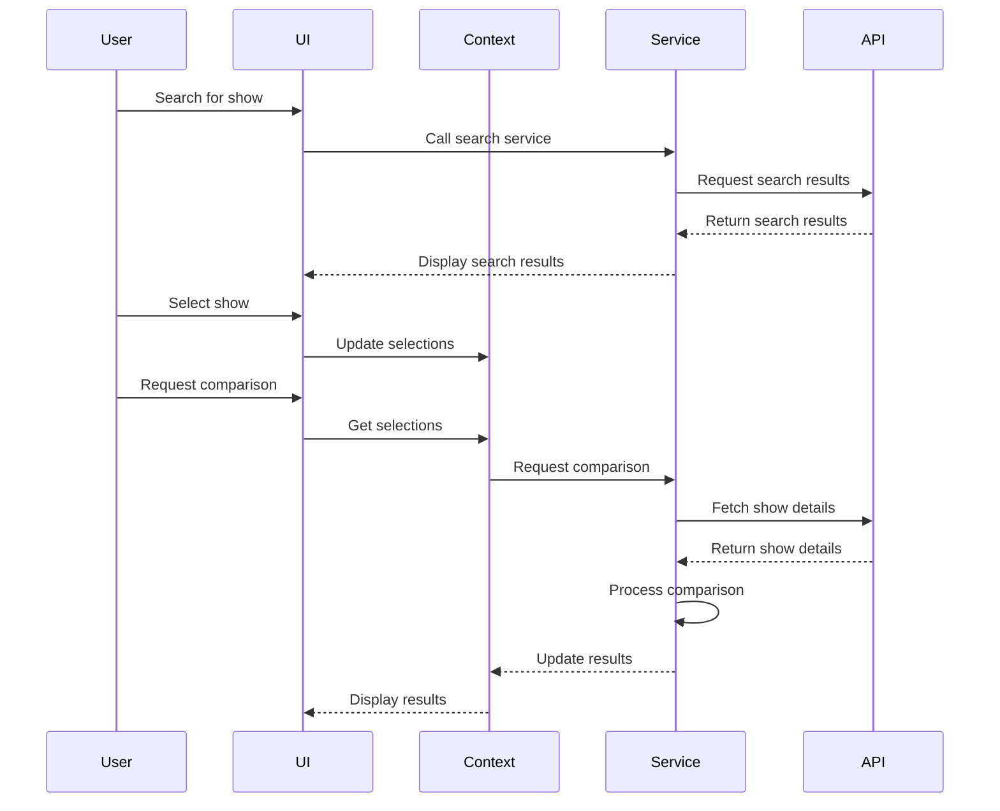
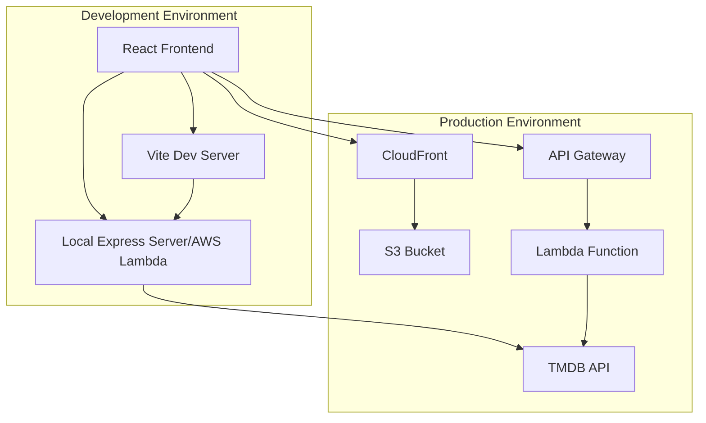
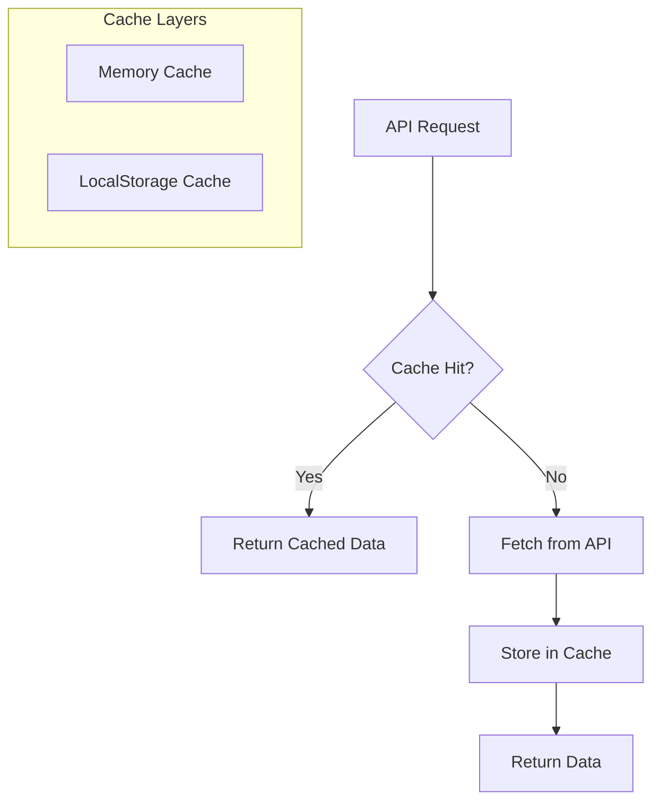
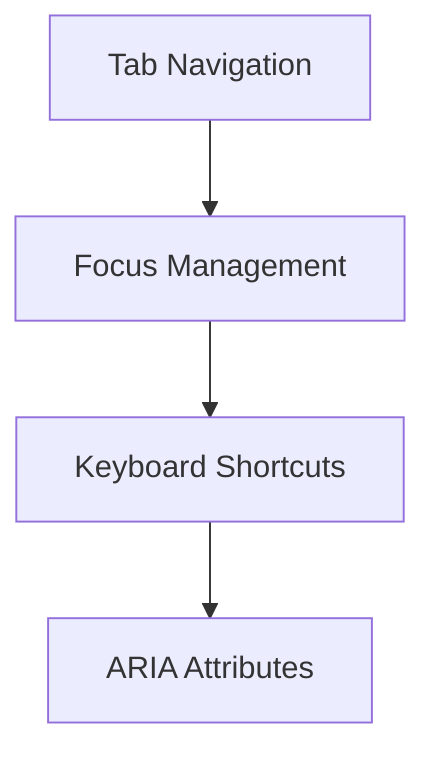
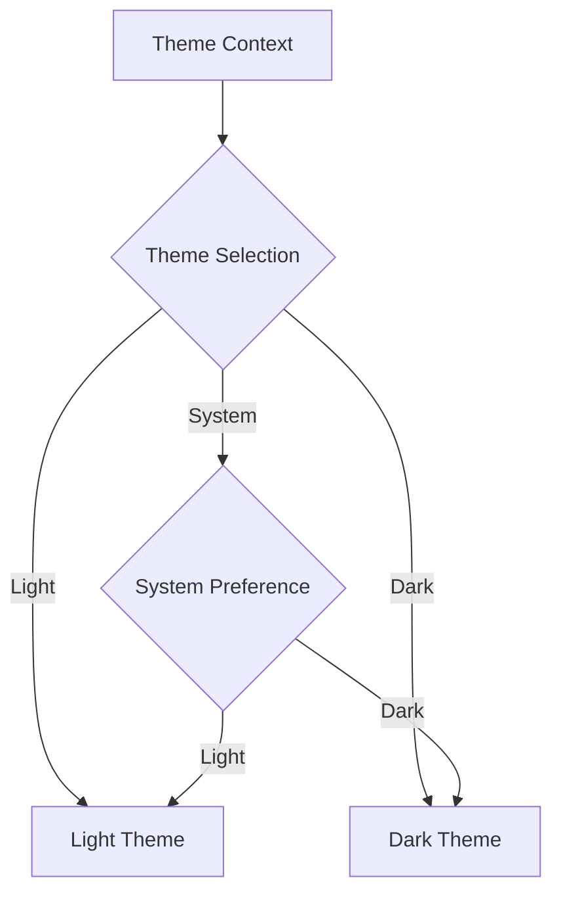

# System Architecture

## Overview

This document details the architecture of the Compare TV Shows application, including component structure, data flow, and system interactions.

## High-Level Architecture



The application follows a layered architecture with clear separation of concerns:

1. **User Interface Layer**: React components for user interaction
2. **State Management Layer**: React Context API for global state
3. **API Layer**: Services for data fetching and processing
4. **Comparison Engine**: Business logic for comparing shows/movies
5. **Theme System**: Manages application theming

## Component Architecture



### Component Responsibilities

#### Core Components

- **App**: Main application component
- **Router**: Handles routing between pages
- **HomePage**: Landing page with search and selection
- **ResultsPage**: Displays comparison results

#### Context Providers

- **ThemeProvider**: Manages theme state (light/dark/system)
- **SelectionProvider**: Manages selected shows/movies
- **ComparisonProvider**: Stores and processes comparison results

#### Feature Components

- **SearchBar**: Handles search input and autosuggestions
- **SelectionList**: Displays and manages selected shows/movies
- **ComparisonResults**: Displays shared cast/crew members
- **SharedPerson**: Displays a shared person with their roles
- **FilterControls**: Provides filtering options for results

#### UI Components

- **Button**: Reusable button component
- **Card**: Card container component
- **ThemeToggle**: Theme switching control
- **Loading**: Loading indicator
- **Thumbnail**: Image thumbnail with fallback

## Data Flow



### Key Data Flows

1. **Search Flow**:
   - User enters search query
   - SearchBar component calls TMDB service
   - Service makes API request through proxy
   - Results displayed to user

2. **Selection Flow**:
   - User selects show/movie from search results
   - Selection added to SelectionContext
   - SelectionList updated to display selection

3. **Comparison Flow**:
   - User initiates comparison
   - ComparisonContext retrieves selections
   - TMDB service fetches details for each selection
   - For TV shows, service fetches all seasons and episodes
   - Comparison service identifies shared cast/crew
   - Results stored in ComparisonContext
   - UI components display results

## State Management

The application uses React Context API for state management, with three main contexts:

### Theme Context

```javascript
// Initial state
const initialThemeState = {
  theme: 'system', // 'light', 'dark', or 'system'
  systemTheme: 'light', // Detected system theme
};

// Reducer
const themeReducer = (state, action) => {
  switch (action.type) {
    case 'SET_THEME':
      return { ...state, theme: action.payload };
    case 'SET_SYSTEM_THEME':
      return { ...state, systemTheme: action.payload };
    default:
      return state;
  }
};

// Provider
const ThemeProvider = ({ children }) => {
  const [state, dispatch] = useReducer(themeReducer, initialThemeState);
  
  // Effect to detect system theme
  useEffect(() => {
    const mediaQuery = window.matchMedia('(prefers-color-scheme: dark)');
    const handleChange = (e) => {
      dispatch({ 
        type: 'SET_SYSTEM_THEME', 
        payload: e.matches ? 'dark' : 'light' 
      });
    };
    
    handleChange(mediaQuery);
    mediaQuery.addEventListener('change', handleChange);
    
    return () => mediaQuery.removeEventListener('change', handleChange);
  }, []);
  
  // Compute actual theme
  const actualTheme = state.theme === 'system' ? state.systemTheme : state.theme;
  
  // Set theme class on document
  useEffect(() => {
    document.documentElement.classList.remove('light-theme', 'dark-theme');
    document.documentElement.classList.add(`${actualTheme}-theme`);
  }, [actualTheme]);
  
  const value = {
    theme: state.theme,
    actualTheme,
    setTheme: (theme) => dispatch({ type: 'SET_THEME', payload: theme }),
  };
  
  return (
    <ThemeContext.Provider value={value}>
      {children}
    </ThemeContext.Provider>
  );
};
```

### Selection Context

```javascript
// Initial state
const initialSelectionState = {
  selections: [], // Array of selected shows/movies
  loading: false,
  error: null,
};

// Reducer
const selectionReducer = (state, action) => {
  switch (action.type) {
    case 'ADD_SELECTION':
      return { 
        ...state, 
        selections: [...state.selections, action.payload],
        error: null,
      };
    case 'REMOVE_SELECTION':
      return { 
        ...state, 
        selections: state.selections.filter(item => item.id !== action.payload),
        error: null,
      };
    case 'SET_LOADING':
      return { ...state, loading: action.payload };
    case 'SET_ERROR':
      return { ...state, error: action.payload };
    default:
      return state;
  }
};

// Provider
const SelectionProvider = ({ children }) => {
  const [state, dispatch] = useReducer(selectionReducer, initialSelectionState);
  
  const value = {
    selections: state.selections,
    loading: state.loading,
    error: state.error,
    addSelection: (selection) => {
      // Check if already selected
      if (state.selections.some(item => item.id === selection.id)) {
        dispatch({ 
          type: 'SET_ERROR', 
          payload: 'This item is already selected' 
        });
        return;
      }
      
      dispatch({ type: 'ADD_SELECTION', payload: selection });
    },
    removeSelection: (id) => {
      dispatch({ type: 'REMOVE_SELECTION', payload: id });
    },
    setLoading: (loading) => {
      dispatch({ type: 'SET_LOADING', payload: loading });
    },
  };
  
  return (
    <SelectionContext.Provider value={value}>
      {children}
    </SelectionContext.Provider>
  );
};
```

### Comparison Context

```javascript
// Initial state
const initialComparisonState = {
  results: [], // Array of shared people with roles
  loading: false,
  error: null,
  filters: {
    roles: [], // Active role filters
    minImportance: 0, // Minimum importance score
  },
};

// Reducer
const comparisonReducer = (state, action) => {
  switch (action.type) {
    case 'SET_RESULTS':
      return { ...state, results: action.payload, loading: false };
    case 'SET_LOADING':
      return { ...state, loading: action.payload };
    case 'SET_ERROR':
      return { ...state, error: action.payload, loading: false };
    case 'SET_FILTERS':
      return { ...state, filters: { ...state.filters, ...action.payload } };
    default:
      return state;
  }
};

// Provider
const ComparisonProvider = ({ children }) => {
  const [state, dispatch] = useReducer(comparisonReducer, initialComparisonState);
  const { selections } = useSelection();
  const tmdbService = useTMDB();
  
  const compareSelections = async () => {
    if (selections.length < 2) {
      dispatch({ 
        type: 'SET_ERROR', 
        payload: 'Please select at least two shows/movies to compare' 
      });
      return;
    }
    
    dispatch({ type: 'SET_LOADING', payload: true });
    
    try {
      // Fetch details for all selections
      const detailedSelections = await Promise.all(
        selections.map(async (selection) => {
          if (selection.media_type === 'tv') {
            return await tmdbService.getShowWithAllCredits(selection.id);
          } else {
            return await tmdbService.getMovieWithCredits(selection.id);
          }
        })
      );
      
      // Find shared people
      const sharedPeople = findSharedPeople(detailedSelections);
      
      // Rank by importance
      const rankedResults = rankByImportance(sharedPeople);
      
      dispatch({ type: 'SET_RESULTS', payload: rankedResults });
    } catch (error) {
      dispatch({ type: 'SET_ERROR', payload: error.message });
    }
  };
  
  const setFilters = (filters) => {
    dispatch({ type: 'SET_FILTERS', payload: filters });
  };
  
  // Get filtered results
  const filteredResults = useMemo(() => {
    return state.results.filter(person => {
      // Filter by role if filters are active
      if (state.filters.roles.length > 0) {
        const hasMatchingRole = person.roles.some(role => 
          state.filters.roles.includes(role.group)
        );
        if (!hasMatchingRole) return false;
      }
      
      // Filter by importance
      return person.importance >= state.filters.minImportance;
    });
  }, [state.results, state.filters]);
  
  const value = {
    results: filteredResults,
    loading: state.loading,
    error: state.error,
    filters: state.filters,
    compareSelections,
    setFilters,
  };
  
  return (
    <ComparisonContext.Provider value={value}>
      {children}
    </ComparisonContext.Provider>
  );
};
```

## API Integration

The application integrates with the TMDB API through a secure proxy:



### Development Environment

- React application served by Vite development server
- Local Express server acts as proxy for TMDB API
- API key stored in environment variables

### Production Environment

- React application hosted on S3 and served through CloudFront
- AWS Lambda function acts as proxy for TMDB API
- API key stored in Lambda environment variables

## Caching Strategy

To optimize performance and reduce API calls, the application implements a multi-level caching strategy:



### Memory Cache

- In-memory cache for current session
- Fastest access but cleared on page refresh
- Used for frequently accessed data

### LocalStorage Cache

- Persistent cache using browser's localStorage
- Survives page refreshes
- Used for less volatile data like show details
- Implements expiration to ensure data freshness

### Caching Implementation

```javascript
// Cache service
const CACHE_PREFIX = 'tmdb_cache_';
const DEFAULT_EXPIRY = 24 * 60 * 60 * 1000; // 24 hours

// Memory cache
const memoryCache = new Map();

// Check if cache exists and is valid
const getCachedData = (key) => {
  // Check memory cache first
  if (memoryCache.has(key)) {
    return memoryCache.get(key);
  }
  
  // Check localStorage
  try {
    const cacheKey = `${CACHE_PREFIX}${key}`;
    const cachedItem = localStorage.getItem(cacheKey);
    
    if (!cachedItem) return null;
    
    const { data, expiry } = JSON.parse(cachedItem);
    
    // Check if expired
    if (expiry < Date.now()) {
      localStorage.removeItem(cacheKey);
      return null;
    }
    
    // Store in memory cache for faster access
    memoryCache.set(key, data);
    
    return data;
  } catch (error) {
    console.error('Cache error:', error);
    return null;
  }
};

// Set cache data
const setCacheData = (key, data, expiryMs = DEFAULT_EXPIRY) => {
  // Set in memory cache
  memoryCache.set(key, data);
  
  // Set in localStorage
  try {
    const cacheKey = `${CACHE_PREFIX}${key}`;
    const cacheData = {
      data,
      expiry: Date.now() + expiryMs,
    };
    
    localStorage.setItem(cacheKey, JSON.stringify(cacheData));
  } catch (error) {
    console.error('Cache error:', error);
  }
};

// Clear cache
const clearCache = (keyPattern = '') => {
  // Clear memory cache
  if (keyPattern) {
    for (const key of memoryCache.keys()) {
      if (key.includes(keyPattern)) {
        memoryCache.delete(key);
      }
    }
  } else {
    memoryCache.clear();
  }
  
  // Clear localStorage
  try {
    if (keyPattern) {
      for (let i = 0; i < localStorage.length; i++) {
        const key = localStorage.key(i);
        if (key.startsWith(CACHE_PREFIX) && key.includes(keyPattern)) {
          localStorage.removeItem(key);
        }
      }
    } else {
      for (let i = localStorage.length - 1; i >= 0; i--) {
        const key = localStorage.key(i);
        if (key.startsWith(CACHE_PREFIX)) {
          localStorage.removeItem(key);
        }
      }
    }
  } catch (error) {
    console.error('Cache error:', error);
  }
};
```

## Keyboard Navigation

The application implements comprehensive keyboard navigation to ensure accessibility:



### Implementation Approach

1. **Focus Management**:
   - Track focused elements
   - Implement focus trapping for modals
   - Provide visual indicators for focused elements

2. **Keyboard Shortcuts**:
   - Arrow keys for navigation
   - Enter/Space for selection
   - Escape for cancellation

3. **ARIA Attributes**:
   - Proper roles for components
   - aria-label for unlabeled elements
   - aria-expanded for expandable elements

### Custom Hook for Keyboard Navigation

```javascript
// useKeyboardNavigation hook
const useKeyboardNavigation = (ref, options = {}) => {
  const {
    onArrowUp,
    onArrowDown,
    onArrowLeft,
    onArrowRight,
    onEnter,
    onEscape,
    onSpace,
    onTab,
    onShiftTab,
  } = options;
  
  useEffect(() => {
    const element = ref.current;
    if (!element) return;
    
    const handleKeyDown = (e) => {
      switch (e.key) {
        case 'ArrowUp':
          if (onArrowUp) {
            e.preventDefault();
            onArrowUp(e);
          }
          break;
        case 'ArrowDown':
          if (onArrowDown) {
            e.preventDefault();
            onArrowDown(e);
          }
          break;
        case 'ArrowLeft':
          if (onArrowLeft) {
            e.preventDefault();
            onArrowLeft(e);
          }
          break;
        case 'ArrowRight':
          if (onArrowRight) {
            e.preventDefault();
            onArrowRight(e);
          }
          break;
        case 'Enter':
          if (onEnter) {
            e.preventDefault();
            onEnter(e);
          }
          break;
        case 'Escape':
          if (onEscape) {
            e.preventDefault();
            onEscape(e);
          }
          break;
        case ' ':
          if (onSpace) {
            e.preventDefault();
            onSpace(e);
          }
          break;
        case 'Tab':
          if (e.shiftKey && onShiftTab) {
            onShiftTab(e);
          } else if (!e.shiftKey && onTab) {
            onTab(e);
          }
          break;
        default:
          break;
      }
    };
    
    element.addEventListener('keydown', handleKeyDown);
    
    return () => {
      element.removeEventListener('keydown', handleKeyDown);
    };
  }, [ref, onArrowUp, onArrowDown, onArrowLeft, onArrowRight, onEnter, onEscape, onSpace, onTab, onShiftTab]);
};
```

## Theming System

The application implements a theme system with light, dark, and system options:



### Implementation with Tailwind CSS

```javascript
// tailwind.config.js
module.exports = {
  darkMode: 'class',
  theme: {
    extend: {
      colors: {
        // Light theme colors
        'primary-light': '#8a6eff',
        'secondary-light': '#ff6e91',
        'background-light': '#f8f9fa',
        'surface-light': '#ffffff',
        'text-light': '#212529',
        
        // Dark theme colors
        'primary-dark': '#bb86fc',
        'secondary-dark': '#ff7597',
        'background-dark': '#121212',
        'surface-dark': '#1e1e1e',
        'text-dark': '#e9ecef',
      },
    },
  },
  variants: {
    extend: {
      backgroundColor: ['dark'],
      textColor: ['dark'],
      borderColor: ['dark'],
    },
  },
  plugins: [],
};
```

### Theme Toggle Component

```javascript
// ThemeToggle.jsx
const ThemeToggle = () => {
  const { theme, setTheme } = useTheme();
  
  const handleThemeChange = (e) => {
    setTheme(e.target.value);
  };
  
  return (
    <div className="theme-toggle">
      <label htmlFor="theme-select" className="sr-only">
        Choose theme
      </label>
      <select
        id="theme-select"
        value={theme}
        onChange={handleThemeChange}
        className="bg-surface-light dark:bg-surface-dark text-text-light dark:text-text-dark rounded border border-gray-300 dark:border-gray-700 p-2"
      >
        <option value="light">Light</option>
        <option value="dark">Dark</option>
        <option value="system">System</option>
      </select>
    </div>
  );
};
```

## Performance Optimizations

The application implements several performance optimizations:

1. **Code Splitting**:
   - React.lazy for component loading
   - Dynamic imports for routes

2. **Memoization**:
   - React.memo for components
   - useMemo for expensive calculations
   - useCallback for stable callbacks

3. **Virtualized Lists**:
   - For large result sets
   - Only render visible items

4. **Image Optimization**:
   - Lazy loading
   - Appropriate sizes
   - WebP format when supported

5. **API Request Optimization**:
   - Caching
   - Request batching
   - Throttling
