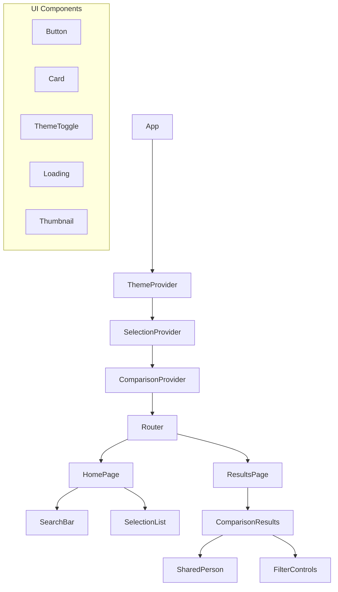

# Component Documentation

This document provides detailed documentation for the React components in the Compare TV Shows application.

## Component Structure

The application follows a modular component structure with clear separation of concerns:



## Core Components

### App

The main application component that sets up providers and routing.

```jsx
// App.jsx
import { BrowserRouter as Router } from 'react-router-dom';
import { ThemeProvider } from './context/ThemeContext';
import { SelectionProvider } from './context/SelectionContext';
import { ComparisonProvider } from './context/ComparisonContext';
import AppRoutes from './AppRoutes';

const App = () => {
  return (
    <ThemeProvider>
      <SelectionProvider>
        <ComparisonProvider>
          <Router>
            <AppRoutes />
          </Router>
        </ComparisonProvider>
      </SelectionProvider>
    </ThemeProvider>
  );
};

export default App;
```

### AppRoutes

Defines the application routes.

```jsx
// AppRoutes.jsx
import { Routes, Route } from 'react-router-dom';
import HomePage from './components/pages/HomePage';
import ResultsPage from './components/pages/ResultsPage';
import MainLayout from './components/layout/MainLayout';

const AppRoutes = () => {
  return (
    <Routes>
      <Route path="/" element={<MainLayout />}>
        <Route index element={<HomePage />} />
        <Route path="results" element={<ResultsPage />} />
      </Route>
    </Routes>
  );
};

export default AppRoutes;
```

## Layout Components

### MainLayout

The main layout wrapper that includes the header and footer.

```jsx
// MainLayout.jsx
import { Outlet } from 'react-router-dom';
import Header from './Header';
import Footer from './Footer';

const MainLayout = () => {
  return (
    <div className="flex flex-col min-h-screen">
      <Header />
      <main className="flex-grow container mx-auto px-4 py-8">
        <Outlet />
      </main>
      <Footer />
    </div>
  );
};

export default MainLayout;
```

### Header

The application header with navigation and theme toggle.

```jsx
// Header.jsx
import { Link } from 'react-router-dom';
import ThemeToggle from '../ui/ThemeToggle';

const Header = () => {
  return (
    <header className="bg-surface-light dark:bg-surface-dark shadow-md">
      <div className="container mx-auto px-4 py-4 flex justify-between items-center">
        <Link to="/" className="text-2xl font-bold text-primary-light dark:text-primary-dark">
          Compare TV Shows
        </Link>
        <ThemeToggle />
      </div>
    </header>
  );
};

export default Header;
```

### Footer

The application footer.

```jsx
// Footer.jsx
const Footer = () => {
  return (
    <footer className="bg-surface-light dark:bg-surface-dark shadow-inner mt-auto">
      <div className="container mx-auto px-4 py-4 text-center">
        <p className="text-sm">
          Powered by <a href="https://www.themoviedb.org/" target="_blank" rel="noopener noreferrer" className="text-primary-light dark:text-primary-dark">The Movie Database</a>
        </p>
      </div>
    </footer>
  );
};

export default Footer;
```

## Page Components

### HomePage

The landing page with search and selection functionality.

```jsx
// HomePage.jsx
import { useNavigate } from 'react-router-dom';
import SearchBar from '../search/SearchBar';
import SelectionList from '../search/SelectionList';
import Button from '../ui/Button';
import { useSelection } from '../../context/SelectionContext';
import { useComparison } from '../../context/ComparisonContext';

const HomePage = () => {
  const navigate = useNavigate();
  const { selections } = useSelection();
  const { compareSelections, loading } = useComparison();
  
  const handleCompare = async () => {
    await compareSelections();
    navigate('/results');
  };
  
  return (
    <div className="space-y-8">
      <div className="text-center">
        <h1 className="text-3xl font-bold mb-4">Compare TV Shows and Movies</h1>
        <p className="text-lg mb-8">
          Find shared cast and crew members between your favorite shows and movies.
        </p>
      </div>
      
      <SearchBar />
      
      <SelectionList />
      
      <div className="text-center">
        <Button 
          onClick={handleCompare} 
          disabled={selections.length < 2 || loading}
          variant="primary"
          size="lg"
        >
          {loading ? 'Loading...' : 'Compare Selections'}
        </Button>
        {selections.length < 2 && (
          <p className="text-sm mt-2 text-red-500">
            Please select at least two shows or movies to compare.
          </p>
        )}
      </div>
    </div>
  );
};

export default HomePage;
```

### ResultsPage

Displays the comparison results.

```jsx
// ResultsPage.jsx
import { useNavigate } from 'react-router-dom';
import ComparisonResults from '../comparison/ComparisonResults';
import FilterControls from '../comparison/FilterControls';
import Button from '../ui/Button';
import { useComparison } from '../../context/ComparisonContext';

const ResultsPage = () => {
  const navigate = useNavigate();
  const { results, loading, error } = useComparison();
  
  if (loading) {
    return (
      <div className="text-center py-12">
        <Loading size="lg" />
        <p className="mt-4">Analyzing cast and crew data...</p>
      </div>
    );
  }
  
  if (error) {
    return (
      <div className="text-center py-12">
        <h2 className="text-2xl font-bold text-red-500 mb-4">Error</h2>
        <p className="mb-6">{error}</p>
        <Button onClick={() => navigate('/')} variant="primary">
          Back to Home
        </Button>
      </div>
    );
  }
  
  if (!results || results.length === 0) {
    return (
      <div className="text-center py-12">
        <h2 className="text-2xl font-bold mb-4">No Shared Cast or Crew</h2>
        <p className="mb-6">
          We couldn't find any shared cast or crew members between your selections.
        </p>
        <Button onClick={() => navigate('/')} variant="primary">
          Back to Home
        </Button>
      </div>
    );
  }
  
  return (
    <div className="space-y-8">
      <div className="flex justify-between items-center">
        <h1 className="text-2xl font-bold">Comparison Results</h1>
        <Button onClick={() => navigate('/')} variant="secondary">
          Back to Home
        </Button>
      </div>
      
      <FilterControls />
      
      <ComparisonResults />
    </div>
  );
};

export default ResultsPage;
```

## Search Components

### SearchBar

Handles search input and displays autosuggestions.

```jsx
// SearchBar.jsx
import { useState, useEffect, useRef } from 'react';
import { useSearch } from '../../hooks/useSearch';
import { useSelection } from '../../context/SelectionContext';
import SearchResults from './SearchResults';
import Loading from '../ui/Loading';
import { useKeyboardNavigation } from '../../hooks/useKeyboardNavigation';

const SearchBar = () => {
  const [query, setQuery] = useState('');
  const [showResults, setShowResults] = useState(false);
  const { results, loading, search } = useSearch();
  const { addSelection } = useSelection();
  const inputRef = useRef(null);
  const resultsRef = useRef(null);
  
  useEffect(() => {
    if (query.trim().length >= 2) {
      search(query);
      setShowResults(true);
    } else {
      setShowResults(false);
    }
  }, [query, search]);
  
  const handleSelect = (item) => {
    addSelection(item);
    setQuery('');
    setShowResults(false);
    inputRef.current.focus();
  };
  
  const handleClickOutside = (e) => {
    if (
      resultsRef.current && 
      !resultsRef.current.contains(e.target) && 
      !inputRef.current.contains(e.target)
    ) {
      setShowResults(false);
    }
  };
  
  useEffect(() => {
    document.addEventListener('mousedown', handleClickOutside);
    return () => {
      document.removeEventListener('mousedown', handleClickOutside);
    };
  }, []);
  
  useKeyboardNavigation(inputRef, {
    onArrowDown: () => {
      if (showResults && resultsRef.current) {
        const firstResult = resultsRef.current.querySelector('[tabindex="0"]');
        if (firstResult) {
          firstResult.focus();
        }
      }
    },
    onEscape: () => {
      setShowResults(false);
    },
  });
  
  return (
    <div className="relative">
      <div className="flex items-center">
        <input
          ref={inputRef}
          type="text"
          value={query}
          onChange={(e) => setQuery(e.target.value)}
          placeholder="Search for TV shows or movies..."
          className="w-full p-3 border rounded-lg bg-white dark:bg-gray-800 border-gray-300 dark:border-gray-700 focus:ring-2 focus:ring-primary-light dark:focus:ring-primary-dark focus:border-transparent"
          aria-label="Search for TV shows or movies"
          aria-expanded={showResults}
          aria-controls="search-results"
        />
        {loading && (
          <div className="absolute right-3">
            <Loading size="sm" />
          </div>
        )}
      </div>
      
      {showResults && (
        <div 
          ref={resultsRef}
          id="search-results"
          className="absolute z-10 w-full mt-1 bg-white dark:bg-gray-800 border border-gray-300 dark:border-gray-700 rounded-lg shadow-lg max-h-96 overflow-y-auto"
        >
          <SearchResults results={results} onSelect={handleSelect} />
        </div>
      )}
    </div>
  );
};

export default SearchBar;
```

### SearchResults

Displays search results with selection option.

```jsx
// SearchResults.jsx
import { useRef } from 'react';
import Thumbnail from '../ui/Thumbnail';
import { useKeyboardNavigation } from '../../hooks/useKeyboardNavigation';
import { getImageUrl, formatReleaseDate } from '../../utils/tmdbHelpers';

const SearchResults = ({ results, onSelect }) => {
  if (!results || results.length === 0) {
    return (
      <div className="p-4 text-center">
        No results found.
      </div>
    );
  }
  
  return (
    <ul className="py-2">
      {results.map((item, index) => (
        <SearchResultItem 
          key={`${item.id}-${item.media_type}`}
          item={item}
          onSelect={onSelect}
          tabIndex={index}
        />
      ))}
    </ul>
  );
};

const SearchResultItem = ({ item, onSelect, tabIndex }) => {
  const ref = useRef(null);
  const isMovie = item.media_type === 'movie';
  const title = isMovie ? item.title : item.name;
  const date = isMovie ? item.release_date : item.first_air_date;
  
  useKeyboardNavigation(ref, {
    onEnter: () => onSelect(item),
    onSpace: () => onSelect(item),
    onArrowDown: (e) => {
      const next = e.target.nextElementSibling;
      if (next) {
        next.focus();
      }
    },
    onArrowUp: (e) => {
      const prev = e.target.previousElementSibling;
      if (prev) {
        prev.focus();
      }
    },
  });
  
  return (
    <li
      ref={ref}
      tabIndex={tabIndex}
      className="px-4 py-2 hover:bg-gray-200 dark:hover:bg-gray-700 cursor-pointer focus:outline-none focus:bg-gray-200 dark:focus:bg-gray-700"
      onClick={() => onSelect(item)}
      role="option"
      aria-selected="false"
    >
      <div className="flex items-center">
        <Thumbnail 
          src={getImageUrl(item.poster_path, 'w92')} 
          alt={title}
          size="sm"
        />
        <div className="ml-3">
          <div className="font-medium">{title}</div>
          <div className="text-sm text-gray-500 dark:text-gray-400 flex items-center">
            <span className="capitalize">{item.media_type}</span>
            {date && (
              <>
                <span className="mx-1">•</span>
                <span>{formatReleaseDate(date)}</span>
              </>
            )}
          </div>
        </div>
      </div>
    </li>
  );
};

export default SearchResults;
```

### SelectionList

Displays selected shows/movies with remove option.

```jsx
// SelectionList.jsx
import { useSelection } from '../../context/SelectionContext';
import Card from '../ui/Card';
import Thumbnail from '../ui/Thumbnail';
import Button from '../ui/Button';
import { getImageUrl, formatReleaseDate } from '../../utils/tmdbHelpers';

const SelectionList = () => {
  const { selections, removeSelection } = useSelection();
  
  if (selections.length === 0) {
    return (
      <div className="text-center p-8 border border-dashed border-gray-300 dark:border-gray-700 rounded-lg">
        <p className="text-gray-500 dark:text-gray-400">
          Select TV shows or movies to compare.
        </p>
      </div>
    );
  }
  
  return (
    <div>
      <h2 className="text-xl font-bold mb-4">Your Selections</h2>
      <div className="grid grid-cols-1 md:grid-cols-2 lg:grid-cols-3 gap-4">
        {selections.map((item) => (
          <SelectionCard 
            key={`${item.id}-${item.media_type}`}
            item={item}
            onRemove={removeSelection}
          />
        ))}
      </div>
    </div>
  );
};

const SelectionCard = ({ item, onRemove }) => {
  const isMovie = item.media_type === 'movie';
  const title = isMovie ? item.title : item.name;
  const date = isMovie ? item.release_date : item.first_air_date;
  
  return (
    <Card>
      <div className="flex">
        <Thumbnail 
          src={getImageUrl(item.poster_path, 'w154')} 
          alt={title}
          size="md"
        />
        <div className="ml-4 flex-grow">
          <h3 className="font-bold">{title}</h3>
          <div className="text-sm text-gray-500 dark:text-gray-400 flex items-center mb-2">
            <span className="capitalize">{item.media_type}</span>
            {date && (
              <>
                <span className="mx-1">•</span>
                <span>{formatReleaseDate(date)}</span>
              </>
            )}
          </div>
          <p className="text-sm line-clamp-3">{item.overview}</p>
          <div className="mt-auto pt-2">
            <Button 
              onClick={() => onRemove(item.id)} 
              variant="danger"
              size="sm"
            >
              Remove
            </Button>
          </div>
        </div>
      </div>
    </Card>
  );
};

export default SelectionList;
```

## Comparison Components

### ComparisonResults

Displays the comparison results.

```jsx
// ComparisonResults.jsx
import { useComparison } from '../../context/ComparisonContext';
import SharedPerson from './SharedPerson';
import Card from '../ui/Card';

const ComparisonResults = () => {
  const { results } = useComparison();
  
  return (
    <div className="space-y-4">
      <div className="text-sm text-gray-500 dark:text-gray-400">
        Found {results.length} shared cast/crew members
      </div>
      
      <div className="space-y-4">
        {results.map((person) => (
          <Card key={person.id}>
            <SharedPerson person={person} />
          </Card>
        ))}
      </div>
    </div>
  );
};

export default ComparisonResults;
```

### SharedPerson

Displays a shared person with their roles.

```jsx
// SharedPerson.jsx
import Thumbnail from '../ui/Thumbnail';
import RoleList from './RoleList';
import { getImageUrl } from '../../utils/tmdbHelpers';

const SharedPerson = ({ person }) => {
  return (
    <div className="flex flex-col md:flex-row">
      <div className="flex-shrink-0 mb-4 md:mb-0">
        <Thumbnail 
          src={getImageUrl(person.profile_path, 'w185')} 
          alt={person.name}
          size="lg"
        />
      </div>
      
      <div className="md:ml-6 flex-grow">
        <div className="flex items-center mb-2">
          <h3 className="text-xl font-bold">{person.name}</h3>
          <div className="ml-auto text-sm bg-primary-light dark:bg-primary-dark text-white px-2 py-1 rounded-full">
            Score: {person.importance.toFixed(1)}
          </div>
        </div>
        
        <RoleList roles={person.roles} />
      </div>
    </div>
  );
};

export default SharedPerson;
```

### RoleList

Displays a list of roles for a person.

```jsx
// RoleList.jsx
import { useMemo } from 'react';
import { groupRolesByProject } from '../../utils/roleGrouping';

const RoleList = ({ roles }) => {
  const groupedRoles = useMemo(() => groupRolesByProject(roles), [roles]);
  
  return (
    <div className="space-y-4">
      {Object.entries(groupedRoles).map(([projectId, projectRoles]) => (
        <ProjectRoles 
          key={projectId} 
          projectName={projectRoles.projectName}
          roles={projectRoles.roles}
        />
      ))}
    </div>
  );
};

const ProjectRoles = ({ projectName, roles }) => {
  return (
    <div>
      <h4 className="font-bold mb-2">{projectName}</h4>
      <div className="flex flex-wrap gap-2">
        {roles.map((role, index) => (
          <RoleBadge key={index} role={role} />
        ))}
      </div>
    </div>
  );
};

const RoleBadge = ({ role }) => {
  // Get color based on role group
  const getBadgeColor = (group) => {
    switch (group) {
      case 'acting':
        return 'bg-blue-100 text-blue-800 dark:bg-blue-900 dark:text-blue-200';
      case 'directing':
        return 'bg-green-100 text-green-800 dark:bg-green-900 dark:text-green-200';
      case 'writing':
        return 'bg-purple-100 text-purple-800 dark:bg-purple-900 dark:text-purple-200';
      case 'production':
        return 'bg-yellow-100 text-yellow-800 dark:bg-yellow-900 dark:text-yellow-200';
      case 'sound':
        return 'bg-pink-100 text-pink-800 dark:bg-pink-900 dark:text-pink-200';
      case 'camera':
        return 'bg-indigo-100 text-indigo-800 dark:bg-indigo-900 dark:text-indigo-200';
      case 'art':
        return 'bg-red-100 text-red-800 dark:bg-red-900 dark:text-red-200';
      case 'editing':
        return 'bg-gray-200 text-gray-800 dark:bg-gray-700 dark:text-gray-200';
      default:
        return 'bg-gray-200 text-gray-800 dark:bg-gray-700 dark:text-gray-200';
    }
  };
  
  return (
    <span className={`px-2 py-1 rounded-full text-sm ${getBadgeColor(role.group)}`}>
      {role.job}
      {role.episodeCount > 1 && ` (${role.episodeCount} episodes)`}
    </span>
  );
};

export default RoleList;
```

### FilterControls

Provides filtering options for results.

```jsx
// FilterControls.jsx
import { useState } from 'react';
import { useComparison } from '../../context/ComparisonContext';

const FilterControls = () => {
  const { filters, setFilters } = useComparison();
  const [expanded, setExpanded] = useState(false);
  
  const roleGroups = [
    { id: 'acting', label: 'Acting' },
    { id: 'directing', label: 'Directing' },
    { id: 'writing', label: 'Writing' },
    { id: 'production', label: 'Production' },
    { id: 'sound', label: 'Sound' },
    { id: 'camera', label: 'Camera' },
    { id: 'art', label: 'Art' },
    { id: 'editing', label: 'Editing' },
    { id: 'crew', label: 'Other Crew' },
  ];
  
  const handleRoleToggle = (roleId) => {
    const newRoles = [...filters.roles];
    
    if (newRoles.includes(roleId)) {
      // Remove role
      const index = newRoles.indexOf(roleId);
      newRoles.splice(index, 1);
    } else {
      // Add role
      newRoles.push(roleId);
    }
    
    setFilters({ roles: newRoles });
  };
  
  const handleImportanceChange = (e) => {
    setFilters({ minImportance: parseFloat(e.target.value) });
  };
  
  const clearFilters = () => {
    setFilters({ roles: [], minImportance: 0 });
  };
  
  return (
    <div className="bg-surface-light dark:bg-surface-dark border border-gray-200 dark:border-gray-700 rounded-lg p-4">
      <div className="flex justify-between items-center mb-4">
        <h2 className="text-lg font-bold">Filters</h2>
        <button
          onClick={() => setExpanded(!expanded)}
          className="text-primary-light dark:text-primary-dark"
          aria-expanded={expanded}
        >
          {expanded ? 'Collapse' : 'Expand'}
        </button>
      </div>
      
      {expanded && (
        <div className="space-y-4">
          <div>
            <h3 className="font-medium mb-2">Role Types</h3>
            <div className="flex flex-wrap gap-2">
              {roleGroups.map((role) => (
                <button
                  key={role.id}
                  onClick={() => handleRoleToggle(role.id)}
                  className={`px-3 py-1 rounded-full text-sm ${
                    filters.roles.includes(role.id)
                      ? 'bg-primary-light dark:bg-primary-dark text-white'
                      : 'bg-gray-200 dark:bg-gray-700 text-gray-800 dark:text-gray-200'
                  }`}
                  aria-pressed={filters.roles.includes(role.id)}
                >
                  {role.label}
                </button>
              ))}
            </div>
          </div>
          
          <div>
            <h3 className="font-medium mb-2">Minimum Importance Score: {filters.minImportance.toFixed(1)}</h3>
            <input
              type="range"
              min="0"
              max="10"
              step="0.5"
              value={filters.minImportance}
              onChange={handleImportanceChange}
              className="w-full"
            />
          </div>
          
          <div className="pt-2 border-t border-gray-200 dark:border-gray-700">
            <button
              onClick={clearFilters}
              className="text-sm text-red-500 dark:text-red-400"
              disabled={filters.roles.length === 0 && filters.minImportance === 0}
            >
              Clear all filters
            </button>
          </div>
        </div>
      )}
    </div>
  );
};

export default FilterControls;
```

## UI Components

### Button

Reusable button component.

```jsx
// Button.jsx
const Button = ({ 
  children, 
  onClick, 
  variant = 'primary', 
  size = 'md',
  disabled = false,
  type = 'button',
  ...props 
}) => {
  const baseClasses = 'inline-flex items-center justify-center rounded-md font-medium focus:outline-none focus:ring-2 focus:ring-offset-2';
  
  const variantClasses = {
    primary: 'bg-primary-light hover:bg-primary-light/90 dark:bg-primary-dark dark:hover:bg-primary-dark/90 text-white focus:ring-primary-light dark:focus:ring-primary-dark',
    secondary: 'bg-gray-200 hover:bg-gray-300 dark:bg-gray-700 dark:hover:bg-gray-600 text-gray-800 dark:text-gray-200 focus:ring-gray-500',
    danger: 'bg-red-500 hover:bg-red-600 dark:bg-red-600 dark:hover:bg-red-700 text-white focus:ring-red-500',
    outline: 'border border-gray-300 dark:border-gray-600 bg-transparent hover:bg-gray-50 dark:hover:bg-gray-800 text-gray-700 dark:text-gray-300 focus:ring-gray-500',
  };
  
  const sizeClasses = {
    sm: 'px-2.5 py-1.5 text-xs',
    md: 'px-4 py-2 text-sm',
    lg: 'px-6 py-3 text-base',
  };
  
  const disabledClasses = 'opacity-50 cursor-not-allowed';
  
  return (
    <button
      type={type}
      onClick={onClick}
      disabled={disabled}
      className={`
        ${baseClasses}
        ${variantClasses[variant]}
        ${sizeClasses[size]}
        ${disabled ? disabledClasses : ''}
      `}
      {...props}
    >
      {children}
    </button>
  );
};

export default Button;
```

### Card

Card container component.

```jsx
// Card.jsx
const Card = ({ children, title, className = '', ...props }) => {
  return (
    <div 
      className={`bg-surface-light dark:bg-surface-dark border border-gray-200 dark:border-gray-700 rounded-lg shadow-sm overflow-hidden ${className}`}
      {...props}
    >
      {title && (
        <div className="px-4 py-3 border-b border-gray-200 dark:border-gray-700">
          <h3 className="font-bold">{title}</h3>
        </div>
      )}
      <div className="p-4">
        {children}
      </div>
    </div>
  );
};

export default Card;
```

### ThemeToggle

Theme switching control.

```jsx
// ThemeToggle.jsx
import { useTheme } from '../../context/ThemeContext';

const ThemeToggle = () => {
  const { theme, setTheme } = useTheme();
  
  return (
    <div className="flex items-center space-x-2">
      <span className="sr-only">Choose theme:</span>
      
      <button
        onClick={() => setTheme('light')}
        className={`p-2 rounded-full focus:outline-none focus:ring-2 focus:ring-primary-light dark:focus:ring-primary-dark ${
          theme === 'light' ? 'bg-gray-200 dark:bg-gray-700' : ''
        }`}
        aria-pressed={theme === 'light'}
        aria-label="Light theme"
      >
        <svg className="w-5 h-5 text-yellow-500" fill="currentColor" viewBox="0 0 20 20">
          <path fillRule="evenodd" d="M10 2a1 1 0 011 1v1a1 1 0 11-2 0V3a1 1 0 011-1zm4 8a4 4 0 11-8 0 4 4 0 018 0zm-.464 4.95l.707.707a1 1 0 001.414-1.414l-.707-.707a1 1 0 00-1.414 1.414zm2.12-10.607a1 1 0 010 1.414l-.706.707a1 1 0 11-1.414-1.414l.707-.707a1 1 0 011.414 0zM17 11a1 1 0 100-2h-1a1 1 0 100 2h1zm-7 4a1 1 0 011
