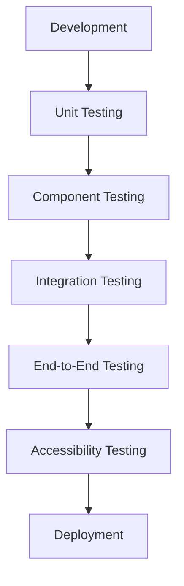

# Testing Strategy

This document outlines the testing strategy for the Compare TV Shows application, including testing approaches, tools, and examples.

## Testing Approach

The application follows a comprehensive testing approach with tests integrated throughout the development process:



Each feature is tested as it's developed, ensuring that issues are caught early in the development process.

## Testing Tools

### Playwright

Playwright is the primary testing tool for the application, used for:

- End-to-end testing
- Component testing
- Visual regression testing
- Accessibility testing

### React Testing Library

Used alongside Playwright for component testing, focusing on:

- Component behavior
- User interactions
- Accessibility

## Test Categories

### 1. Unit Tests

Unit tests focus on testing individual functions and utilities in isolation.

**Example: Testing the importance calculator utility**

```javascript
// importanceCalculator.test.js
import { calculateImportance } from '../src/utils/importanceCalculator';

test('calculates importance score for lead actor', () => {
  const roles = [
    { job: 'Actor', character: 'Walter White', order: 0, department: 'Acting' }
  ];
  
  const score = calculateImportance(roles);
  expect(score).toBeGreaterThan(8); // Lead actors should have high importance
});

test('calculates importance score for background actor', () => {
  const roles = [
    { job: 'Actor', character: 'Background Character', order: 20, department: 'Acting' }
  ];
  
  const score = calculateImportance(roles);
  expect(score).toBeLessThan(5); // Background actors should have lower importance
});

test('calculates importance score for director', () => {
  const roles = [
    { job: 'Director', department: 'Directing' }
  ];
  
  const score = calculateImportance(roles);
  expect(score).toBeGreaterThan(7); // Directors should have high importance
});

test('calculates importance score for multiple roles', () => {
  const roles = [
    { job: 'Director', department: 'Directing' },
    { job: 'Writer', department: 'Writing' }
  ];
  
  const score = calculateImportance(roles);
  expect(score).toBeGreaterThan(9); // Multiple important roles should have very high importance
});
```

### 2. Component Tests

Component tests verify that individual React components render and behave correctly.

**Example: Testing the SearchBar component**

```javascript
// SearchBar.test.js
import { render, screen, fireEvent, waitFor } from '@testing-library/react';
import { SearchBar } from '../src/components/search/SearchBar';
import { SelectionProvider } from '../src/context/SelectionContext';
import * as tmdbService from '../src/services/tmdb';

// Mock the TMDB service
jest.mock('../src/services/tmdb', () => ({
  searchMulti: jest.fn(),
}));

const mockSearchResults = [
  {
    id: 1,
    name: 'Breaking Bad',
    media_type: 'tv',
    first_air_date: '2008-01-20',
    poster_path: '/path/to/poster.jpg',
  },
];

describe('SearchBar', () => {
  beforeEach(() => {
    tmdbService.searchMulti.mockResolvedValue(mockSearchResults);
  });
  
  test('renders search input', () => {
    render(
      <SelectionProvider>
        <SearchBar />
      </SelectionProvider>
    );
    
    const searchInput = screen.getByPlaceholderText('Search for TV shows or movies...');
    expect(searchInput).toBeInTheDocument();
  });
  
  test('shows search results when typing', async () => {
    render(
      <SelectionProvider>
        <SearchBar />
      </SelectionProvider>
    );
    
    const searchInput = screen.getByPlaceholderText('Search for TV shows or movies...');
    fireEvent.change(searchInput, { target: { value: 'breaking' } });
    
    await waitFor(() => {
      expect(tmdbService.searchMulti).toHaveBeenCalledWith('breaking');
    });
    
    const searchResult = await screen.findByText('Breaking Bad');
    expect(searchResult).toBeInTheDocument();
  });
  
  test('adds selection when result is clicked', async () => {
    render(
      <SelectionProvider>
        <SearchBar />
      </SelectionProvider>
    );
    
    const searchInput = screen.getByPlaceholderText('Search for TV shows or movies...');
    fireEvent.change(searchInput, { target: { value: 'breaking' } });
    
    const searchResult = await screen.findByText('Breaking Bad');
    fireEvent.click(searchResult);
    
    // Check that the input is cleared after selection
    expect(searchInput.value).toBe('');
  });
});
```

### 3. End-to-End Tests

End-to-end tests verify that the application works correctly as a whole, testing complete user flows.

**Example: Testing the search and selection flow**

```javascript
// search-selection.spec.js
import { test, expect } from '@playwright/test';

test('user can search for and select shows', async ({ page }) => {
  // Navigate to the application
  await page.goto('http://localhost:3000');
  
  // Search for a show
  const searchInput = page.getByPlaceholderText('Search for TV shows or movies...');
  await searchInput.fill('breaking bad');
  
  // Wait for search results
  const searchResults = page.locator('[role="option"]');
  await expect(searchResults).toHaveCount.atLeast(1);
  
  // Select the first result
  await searchResults.first().click();
  
  // Verify the selection was added
  const selectionTitle = page.getByText('Breaking Bad');
  await expect(selectionTitle).toBeVisible();
  
  // Search for another show
  await searchInput.fill('better call saul');
  
  // Wait for search results
  await expect(searchResults).toHaveCount.atLeast(1);
  
  // Select the first result
  await searchResults.first().click();
  
  // Verify both selections are present
  const selections = page.locator('h3.font-bold');
  await expect(selections).toHaveCount(2);
  
  // Click the compare button
  const compareButton = page.getByRole('button', { name: 'Compare Selections' });
  await compareButton.click();
  
  // Verify we're on the results page
  const resultsTitle = page.getByRole('heading', { name: 'Comparison Results' });
  await expect(resultsTitle).toBeVisible();
  
  // Verify shared cast/crew are displayed
  const sharedPeople = page.locator('.card');
  await expect(sharedPeople).toHaveCount.atLeast(1);
});
```

**Example: Testing the theme toggle**

```javascript
// theme-toggle.spec.js
import { test, expect } from '@playwright/test';

test('theme toggle switches between light and dark modes', async ({ page }) => {
  // Navigate to the application
  await page.goto('http://localhost:3000');
  
  // Check initial theme (default is light or system)
  const html = page.locator('html');
  
  // Click the dark theme button
  const darkThemeButton = page.getByLabel('Dark theme');
  await darkThemeButton.click();
  
  // Verify dark theme is applied
  await expect(html).toHaveClass(/dark-theme/);
  
  // Click the light theme button
  const lightThemeButton = page.getByLabel('Light theme');
  await lightThemeButton.click();
  
  // Verify light theme is applied
  await expect(html).not.toHaveClass(/dark-theme/);
});
```

### 4. Accessibility Tests

Accessibility tests ensure that the application is usable by everyone, including people with disabilities.

**Example: Testing keyboard navigation**

```javascript
// keyboard-navigation.spec.js
import { test, expect } from '@playwright/test';

test('can navigate and select with keyboard only', async ({ page }) => {
  // Navigate to the application
  await page.goto('http://localhost:3000');
  
  // Focus on search input
  await page.keyboard.press('Tab');
  
  // Type search query
  await page.keyboard.type('breaking bad');
  
  // Wait for search results
  const searchResults = page.locator('[role="option"]');
  await expect(searchResults).toHaveCount.atLeast(1);
  
  // Navigate to first result with arrow down
  await page.keyboard.press('ArrowDown');
  
  // Select with Enter
  await page.keyboard.press('Enter');
  
  // Verify the selection was added
  const selectionTitle = page.getByText('Breaking Bad');
  await expect(selectionTitle).toBeVisible();
  
  // Tab to the remove button
  await page.keyboard.press('Tab');
  await page.keyboard.press('Tab');
  
  // Verify focus is on the remove button
  const focusedElement = await page.evaluate(() => document.activeElement.textContent);
  expect(focusedElement).toBe('Remove');
});
```

**Example: Testing screen reader accessibility**

```javascript
// screen-reader.spec.js
import { test, expect } from '@playwright/test';

test('important elements have proper ARIA attributes', async ({ page }) => {
  // Navigate to the application
  await page.goto('http://localhost:3000');
  
  // Check search input has proper aria-label
  const searchInput = page.getByPlaceholderText('Search for TV shows or movies...');
  await expect(searchInput).toHaveAttribute('aria-label', 'Search for TV shows or movies');
  
  // Check search results have proper role
  await searchInput.fill('breaking bad');
  const searchResultsList = page.locator('#search-results');
  await expect(searchResultsList).toBeVisible();
  
  // Check individual results have proper roles
  const searchResults = page.locator('[role="option"]');
  await expect(searchResults.first()).toHaveAttribute('role', 'option');
  
  // Check theme toggle has proper aria-label
  const themeToggle = page.getByLabel('Light theme');
  await expect(themeToggle).toHaveAttribute('aria-label', 'Light theme');
});
```

### 5. Visual Regression Tests

Visual regression tests ensure that the UI appears as expected across different themes and viewport sizes.

**Example: Testing component appearance**

```javascript
// visual-regression.spec.js
import { test, expect } from '@playwright/test';

test('components appear correctly in light mode', async ({ page }) => {
  // Navigate to the application
  await page.goto('http://localhost:3000');
  
  // Ensure light theme is active
  const lightThemeButton = page.getByLabel('Light theme');
  await lightThemeButton.click();
  
  // Take a screenshot of the header
  await expect(page.locator('header')).toHaveScreenshot('header-light.png');
  
  // Search for a show
  const searchInput = page.getByPlaceholderText('Search for TV shows or movies...');
  await searchInput.fill('breaking bad');
  
  // Take a screenshot of search results
  await expect(page.locator('#search-results')).toHaveScreenshot('search-results-light.png');
  
  // Select a show
  const searchResults = page.locator('[role="option"]');
  await searchResults.first().click();
  
  // Take a screenshot of the selection
  await expect(page.locator('.card').first()).toHaveScreenshot('selection-card-light.png');
});

test('components appear correctly in dark mode', async ({ page }) => {
  // Navigate to the application
  await page.goto('http://localhost:3000');
  
  // Ensure dark theme is active
  const darkThemeButton = page.getByLabel('Dark theme');
  await darkThemeButton.click();
  
  // Take a screenshot of the header
  await expect(page.locator('header')).toHaveScreenshot('header-dark.png');
  
  // Search for a show
  const searchInput = page.getByPlaceholderText('Search for TV shows or movies...');
  await searchInput.fill('breaking bad');
  
  // Take a screenshot of search results
  await expect(page.locator('#search-results')).toHaveScreenshot('search-results-dark.png');
  
  // Select a show
  const searchResults = page.locator('[role="option"]');
  await searchResults.first().click();
  
  // Take a screenshot of the selection
  await expect(page.locator('.card').first()).toHaveScreenshot('selection-card-dark.png');
});
```

## Test Organization

Tests are organized by type and feature:

```
tests/
├── e2e/                     # End-to-end tests
│   ├── search-selection.spec.js
│   ├── comparison.spec.js
│   ├── theme-toggle.spec.js
│   └── keyboard-navigation.spec.js
├── components/              # Component tests
│   ├── search/
│   │   ├── SearchBar.test.js
│   │   └── SearchResults.test.js
│   ├── comparison/
│   │   ├── ComparisonResults.test.js
│   │   └── SharedPerson.test.js
│   └── ui/
│       ├── Button.test.js
│       └── ThemeToggle.test.js
├── utils/                   # Unit tests for utilities
│   ├── importanceCalculator.test.js
│   └── roleGrouping.test.js
├── visual/                  # Visual regression tests
│   ├── light-theme.spec.js
│   └── dark-theme.spec.js
├── accessibility/           # Accessibility tests
│   ├── keyboard.spec.js
│   └── screen-reader.spec.js
└── fixtures/                # Test fixtures
    └── mockData.js
```

## Playwright Configuration

```javascript
// playwright.config.js
import { defineConfig } from '@playwright/test';

export default defineConfig({
  testDir: './tests',
  timeout: 30000,
  expect: {
    timeout: 5000
  },
  fullyParallel: true,
  forbidOnly: !!process.env.CI,
  retries: process.env.CI ? 2 : 0,
  workers: process.env.CI ? 1 : undefined,
  reporter: [
    ['html'],
    ['list']
  ],
  use: {
    actionTimeout: 0,
    baseURL: 'http://localhost:3000',
    trace: 'on-first-retry',
    screenshot: 'only-on-failure',
  },
  projects: [
    {
      name: 'chromium',
      use: {
        browserName: 'chromium',
      },
    },
    {
      name: 'firefox',
      use: {
        browserName: 'firefox',
      },
    },
    {
      name: 'webkit',
      use: {
        browserName: 'webkit',
      },
    },
    {
      name: 'Mobile Chrome',
      use: {
        browserName: 'chromium',
        viewport: { width: 414, height: 896 },
        deviceScaleFactor: 2,
        isMobile: true,
      },
    },
  ],
  webServer: {
    command: 'npm run dev',
    port: 3000,
    reuseExistingServer: !process.env.CI,
  },
});
```

## Test Fixtures

Test fixtures provide reusable test data and utilities.

```javascript
// fixtures/mockData.js
export const mockShows = [
  {
    id: 1396,
    name: 'Breaking Bad',
    media_type: 'tv',
    first_air_date: '2008-01-20',
    poster_path: '/ggFHVNu6YYI5L9pCfOacjizRGt.jpg',
    overview: 'A high school chemistry teacher diagnosed with inoperable lung cancer turns to manufacturing and selling methamphetamine in order to secure his family\'s future.',
  },
  {
    id: 60059,
    name: 'Better Call Saul',
    media_type: 'tv',
    first_air_date: '2015-02-08',
    poster_path: '/fC2HDm5t0kHl7mTm7jxMR31b7by.jpg',
    overview: 'Six years before Saul Goodman meets Walter White. We meet him when the man who will become Saul Goodman is known as Jimmy McGill, a small-time lawyer searching for his destiny, and, more immediately, hustling to make ends meet.',
  },
];

export const mockMovies = [
  {
    id: 299536,
    title: 'Avengers: Infinity War',
    media_type: 'movie',
    release_date: '2018-04-25',
    poster_path: '/7WsyChQLEftFiDOVTGkv3hFpyyt.jpg',
    overview: 'As the Avengers and their allies have continued to protect the world from threats too large for any one hero to handle, a new danger has emerged from the cosmic shadows: Thanos.',
  },
  {
    id: 299534,
    title: 'Avengers: Endgame',
    media_type: 'movie',
    release_date: '2019-04-24',
    poster_path: '/or06FN3Dka5tukK1e9sl16pB3iy.jpg',
    overview: 'After the devastating events of Avengers: Infinity War, the universe is in ruins due to the efforts of the Mad Titan, Thanos.',
  },
];

export const mockSharedPeople = [
  {
    id: 66633,
    name: 'Vince Gilligan',
    profile_path: '/rLSUjr725ez1cK7SKVxC9udO9Wv.jpg',
    roles: [
      {
        job: 'Creator',
        department: 'Production',
        projectId: 1396,
        projectName: 'Breaking Bad',
        group: 'production',
      },
      {
        job: 'Executive Producer',
        department: 'Production',
        projectId: 60059,
        projectName: 'Better Call Saul',
        group: 'production',
      },
    ],
    importance: 9.5,
  },
  {
    id: 17419,
    name: 'Bryan Cranston',
    profile_path: '/7Jahy5LZX2Vx65NyEuVhCJAZOzn.jpg',
    roles: [
      {
        job: 'Actor',
        character: 'Walter White',
        department: 'Acting',
        projectId: 1396,
        projectName: 'Breaking Bad',
        group: 'acting',
      },
      {
        job: 'Actor',
        character: 'Walter White',
        department: 'Acting',
        projectId: 60059,
        projectName: 'Better Call Saul',
        episodeCount: 2,
        group: 'acting',
      },
    ],
    importance: 9.0,
  },
];
```

## Continuous Integration

Tests are run automatically on each pull request and merge to main using GitHub Actions.

```yaml
# .github/workflows/test.yml
name: Test

on:
  push:
    branches: [ main ]
  pull_request:
    branches: [ main ]

jobs:
  test:
    runs-on: ubuntu-latest
    
    steps:
    - uses: actions/checkout@v3
    
    - name: Set up Node.js
      uses: actions/setup-node@v3
      with:
        node-version: '18'
        cache: 'npm'
    
    - name: Install dependencies
      run: npm ci
    
    - name: Install Playwright browsers
      run: npx playwright install --with-deps
    
    - name: Run tests
      run: npm test
    
    - name: Upload test results
      if: always()
      uses: actions/upload-artifact@v3
      with:
        name: playwright-report
        path: playwright-report/
        retention-days: 30
```

## Testing Best Practices

1. **Write tests as features are developed**: Don't wait until the end to write tests.
2. **Test user flows, not implementation details**: Focus on what users do, not how it's implemented.
3. **Use realistic test data**: Mock data should be representative of real data.
4. **Test edge cases**: Consider empty states, error states, and boundary conditions.
5. **Test accessibility**: Ensure the application is usable by everyone.
6. **Keep tests independent**: Tests should not depend on each other.
7. **Use descriptive test names**: Test names should describe what's being tested.
8. **Minimize test duplication**: Use fixtures and helper functions to reduce duplication.
9. **Test across browsers**: Ensure the application works in all supported browsers.
10. **Test responsive design**: Verify the application works on different screen sizes.
