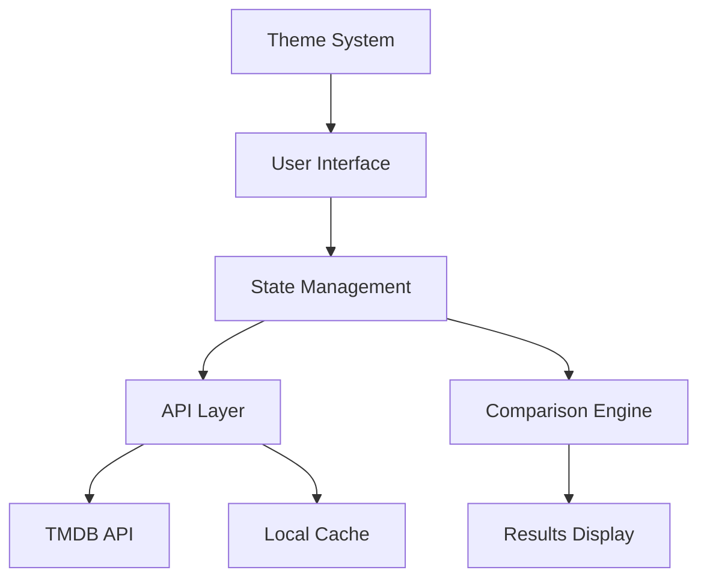
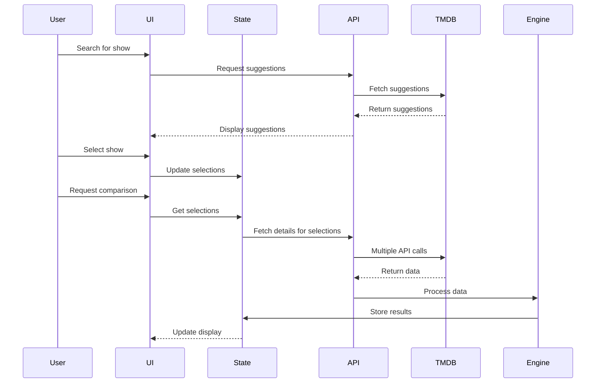

# System Patterns

## System Architecture

## Key Components

### 1. User Interface Layer
- **Search Component**: Handles user input and displays autosuggestions
- **Selection Manager**: Tracks selected TV shows/movies
- **Results Display**: Shows comparison results with filtering options
- **Theme Toggle**: Switches between light, dark, and system themes

### 2. State Management
- Uses React Context API for global state
- Maintains selected shows/movies
- Tracks loading states
- Manages theme preferences
- Stores comparison results

### 3. API Layer
- **Local Development Server**: Proxies requests to TMDB API during development
- **AWS Lambda Proxy**: Secures API key in production
- **Caching Mechanism**: Reduces API calls for frequently accessed data

### 4. Comparison Engine
- Processes cast and crew data
- Identifies shared members
- Ranks by importance
- Groups by role categories

## Design Patterns

### 1. Container/Presentational Pattern
- Container components handle logic and state
- Presentational components focus on rendering UI
- Improves reusability and testing

### 2. Custom Hooks
- `useSearch`: Manages search functionality and autosuggestions
- `useComparison`: Handles comparison logic
- `useTheme`: Controls theme switching
- `useTMDB`: Wraps API calls to TMDB

### 3. Context Providers
- `SelectionContext`: Manages selected shows/movies
- `ThemeContext`: Handles theme state
- `ComparisonContext`: Stores comparison results

### 4. Service Modules
- `tmdbService`: Handles all TMDB API interactions
- `comparisonService`: Contains comparison algorithms
- `cacheService`: Manages data caching

## Data Flow

## Critical Implementation Paths

### 1. TV Show Episode Collection
- Fetch show details
- Fetch season list
- For each season, fetch all episodes
- For each episode, fetch cast and crew
- Aggregate all data

### 2. Comparison Algorithm
- Identify shared people by ID
- For each shared person:
  - Collect all roles across selected projects
  - Calculate importance score based on role types
  - Group similar roles
- Sort by importance score

### 3. Keyboard Navigation
- Implement focus management
- Add keyboard shortcuts
- Ensure all interactive elements are reachable
- Provide visual indicators for focused elements

## Performance Considerations

### 1. API Request Optimization
- Batch requests where possible
- Implement caching for frequently accessed data
- Use pagination for large datasets

### 2. Rendering Optimization
- Virtualized lists for large result sets
- Lazy loading for images
- Code splitting for initial load performance

### 3. State Management Efficiency
- Minimize unnecessary re-renders
- Use memoization for expensive calculations
- Implement debouncing for search inputs
